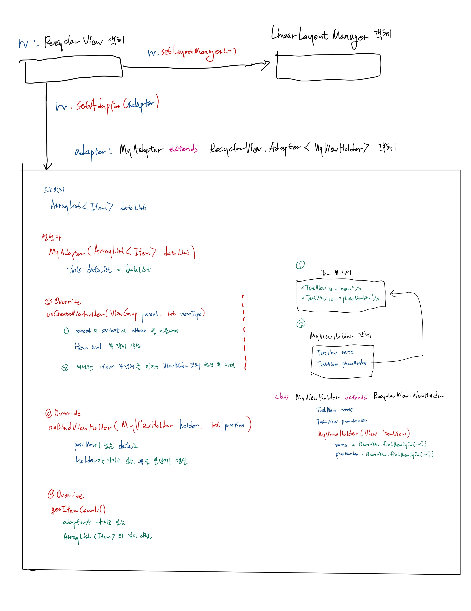

---

# 06-27-2021
## android
---
## Recycler view

  - 순서
    - item 레이아웃 및 item class 정의
    - adapter 및 view holder class 정의
    - recycler view와 adapter 및 layout manager 연결
    - item 추가 후 notifyDataSetChanged 메소드 호출  
    
  - item 레이아웃 및 item class 정의
    - item 레이아웃
      - 예시
        - 이름 표시 text view
        - 전화번호 표시 text view
        ```xml
        <androidx.appcompat.widget.LinearLayoutCompat>
          <TextView android:id="@+id/itemName" />
          <TextView android:id="@+id/itemPhoneNumber" />
        </androidx.appcompat.widget.LinearLayoutCompat>
        ```
    - item class
      - item 레이아웃에 들어갈 정보를 모아둔 클래스
      - 예시
      ```java
      public class MyItem {
        String name;
        String phoneNumber;

        public MyItem(String name, String phoneNumber) {
            this.name = name;
            this.phoneNumber = phoneNumber;
        }
      ```
    <br />
  - adapter 및 view holder class 정의
    - adapter class 정의
      - RecyclerView.Adapter 클래스 상속
      - 프로퍼티
        - 정의한 item class 타입의 ArrayList
      - 오버라이딩 메소드
        - onCreateViewHolder
          - inflater를 통해 item view 객체 생성
          - 생성한 item view 객체를 인자로 한 view holder 객체 생성
        - onBindViewHolder
          - position에 있는 data를 이용해 view holder가 가지고 있는 item view를 알맞게 갱신
        - geItemCount()
          - adapter가 가지고 있는 ArrayList의 길이 리턴
      <br />      
    - view holder class 정의
      - RecyclerView.ViewHolder 클래스 상속
      - 프로퍼티
        - 아이템 레이아웃에서 데이터가 바뀌는 뷰
      - 생성자
        - item view 객체를 인자로 받음
        - 정의한 프로퍼티와 item view 객체를 알맞게 연결
      - 예시
        ```java
        static class MyViewHolder extends RecyclerView.ViewHolder {
          TextView nameTextView;
          TextView phoneNumberTextView;

          public MyViewHolder(View itemView) {
            super(itemView);
            nameTextView = itemView.findViewById(R.id.itemName);
            phoneNumberTextView = itemView.findViewById(R.id.itemPhoneNumber);
        }
        ```
  
  - recycler view와 adapter 및 layout manager 연결
    ```java
    // MainActivity.java
    ArrayList<MyItem> myItems = new ArrayList<>();

    // ...

    // recycler view adapter 생성
    MyRecyclerViewAdapter myRecyclerViewAdapter = new MyRecyclerViewAdapter(myItems);


    RecyclerView recyclerView = findViewById(R.id.MyRecyclerView);

    // recycler view와 adapter 연결
    recyclerView.setAdapter(myRecyclerViewAdapter);
    // recycler view와 layout manager 연결
    recyclerView.setLayoutManager(new LinearLayoutManager(this));
    ```
  
  - item 추가 후 notifyDataSetChanged 메소드 호출
    ```java
    // MainActivity.java
    // ArrayList에 item 추가
    myItems.add(new MyItem(name, phoneNumber));

    // notifyDataSetChanged 메소드 호출
    myRecyclerViewAdapter.notifyDataSetChanged();
    ```

  - 요약
    
